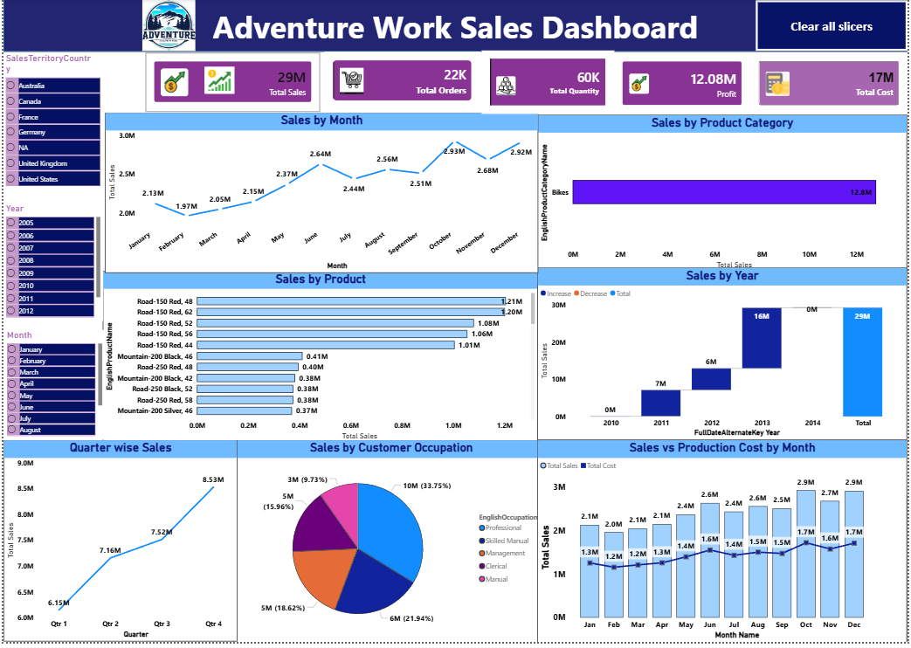
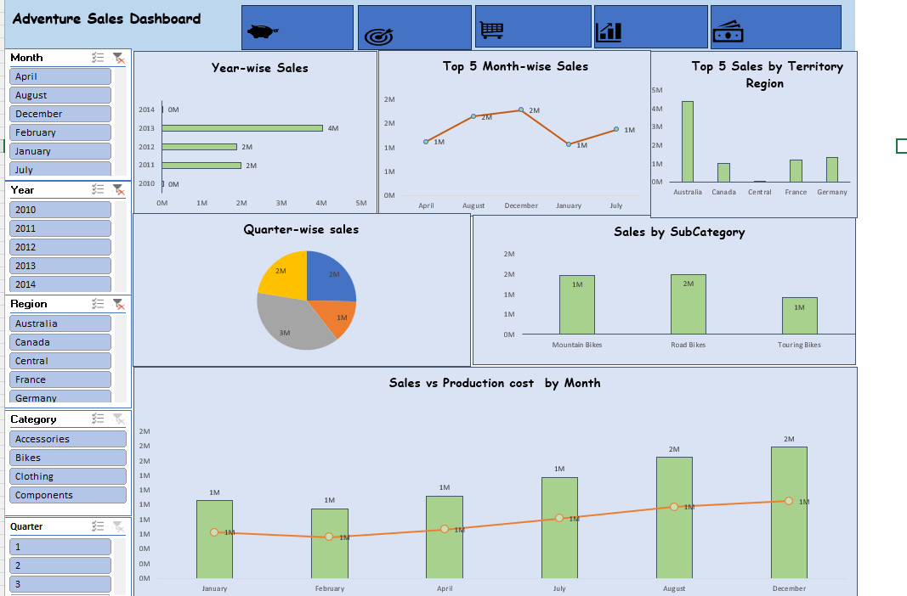

# Adventure Works Sales Analysis

End-to-end sales analysis of the Adventure Works Cycles dataset — from raw data modeling to KPI calculation, interactive Excel dashboards, and a Power BI report.

Adventure Works Cycles is a fictional multinational manufacturer of metal and composite bicycles, used here as a realistic dataset for practicing data analysis, DAX-style calculations, and dashboard design across **SQL, Excel, and Power BI**.

## Tools Used
- **MySQL** – data modeling, joins, date engineering, KPI queries
- **Microsoft Excel** – lookups, calculated columns, pivot tables, interactive dashboard
- **Power BI** – data visualization and dashboard reporting

## Project Workflow

1. Combined `FactInternetSales` and `FactInternetSalesNew` into a single unified sales table
2. Looked up `ProductName` (from DimProduct) and `CustomerFullName` + `UnitPrice` (from DimCustomer / DimProduct) into the Sales table
3. Engineered date fields from `OrderDateKey`: Year, Month Number, Month Name, Quarter, Year-Month, Weekday Number/Name, Financial Month, Financial Quarter
4. Calculated **Sales Amount** (Unit Price × Order Quantity × (1 − Discount %))
5. Calculated **Production Cost** (Unit Cost × Order Quantity)
6. Calculated **Profit** (Sales Amount − Production Cost)
7. Built pivot tables for month-wise sales, filterable by year
8–11. Built Bar, Line, Pie, and combination charts to visualize yearly, monthly, and quarterly sales trends
12. Built KPI cards for Total Sales, Total Orders, Total Quantity, Profit, and Total Cost, broken down by Product, Customer, and Region
13. Assembled interactive dashboards in both Excel and Power BI

## Dashboards

### Power BI Dashboard


### Excel Dashboard


## Key Insights
- Total Sales: **$29M** across **22K orders** and **60K units sold**
- Total Profit: **$12.08M** (~41% margin) with Total Cost of **$17M**
- **Bikes** is by far the dominant product category, contributing the vast majority of revenue
- Sales grew consistently year-over-year, from **$7M in 2011** to **$16M in 2013**
- Q4 is the strongest quarter, with sales peaking at **$8.53M**
- Top-selling products are concentrated in the **Road-150** and **Mountain-200** series
- **Professional** and **Skilled Manual** customer occupations drive the largest share of sales

## Repository Structure

```
adventure-works-sales-analysis/
├── README.md
├── data/
│   └── adventure-works-analysis.xlsx
├── sql/
│   └── analysis-queries.sql
├── powerbi/
│   └── adventure-works-dashboard.pbix
└── images/
    ├── powerbi-dashboard.png
    └── excel-dashboard.png
```

## Dataset
This project uses the publicly available **Adventure Works** sample dataset, widely used for practicing SQL, Excel, and Power BI analytics.

## About Me
**Anson Aron Fernandez** — Data Analyst | SQL, Excel, Power BI
📍 Bengaluru, Karnataka
📧 ansonfernandez003@gmail.com
